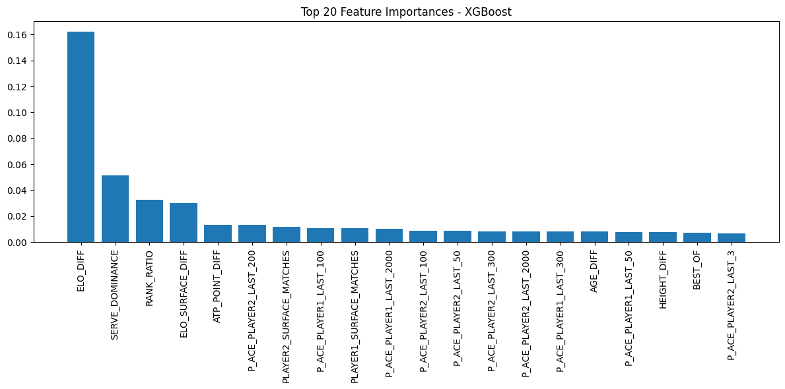

# Tennis Match Prediction with Data Analytics & HPC

## Description

This project aims to predict the outcome of professional tennis matches by leveraging historical ATP data enriched through advanced preprocessing and feature engineering. It is developed as part of a Master's thesis (TFM) in the context of a double degree in Data & HPC (High-Performance Computing).

## Objectives

- Build a unified and enriched dataset from historical ATP matches.
- Apply extensive feature engineering: match statistics, player history, ELO ratings, surfaces.
- Visualize trends, distributions, and variable relationships.
- Train machine learning models to predict match outcomes.
- Extend the project with HPC techniques (parallel processing, distributed model training).

---

## Data Sources

The raw data comes from the [Jeff Sackmann Tennis](https://github.com/JeffSackmann/tennis_atp) repository on GitHub, which provides yearly CSV files with ATP match results.

Data used:

- Files from `data/atp_matches_YEAR.csv`, from 1968 to 2024.

After loading, all files are concatenated into a single file `atp_full.csv`, cleaned, and filtered to keep only matches from the year 2000 onward with no missing values in key features.

---

## Repository Structure

```bash
├── Codes/                          # Scripts and notebooks
│   ├── checklist.py
│   ├── DataAnalysis.ipynb          # Statistics, plots, correlations
│   ├── DataPreprocessing.ipynb     # Data cleaning and dataset creation
│   ├── DataVisualisation.ipynb     # Visual analytics
│   ├── final_tennis_dataset.py     # Dataset builder
│   ├── prediction_dataset.py       # Feature selection
│   └── predictions.ipynb           # ML model training and evaluation
├── Datasets/
│   ├── final_tennis_dataset.csv
│   └── final_tennis_dataset_symmetric.csv
├── Images/                         # Saved plots
├── data/                           # Raw yearly CSV files
├── .gitignore
├── README.md
├── requirements.txt
└── requirements_pip.txt
```

## Data Sources

All raw datasets come from [Jeff Sackmann's ATP match repository](https://github.com/JeffSackmann/tennis_atp), containing historical match records from 1968 to 2024:

- `atp_matches_YYYY.csv` for each year
- Total rows concatenated: over 160,000 matches

## Feature Engineering

We generate over **190 features** to feed machine learning models, including:

### Raw Features

- Official ATP stats: `score`, `aces`, `double faults`, `winner_rank`, `surface`, etc.
- Match year extraction: `year`
- Match length: `minutes`, `best_of`

### Difference Metrics

- `AGE_DIFF`, `HEIGHT_DIFF`
- `ATP_POINT_DIFF`, `ATP_RANK_DIFF`, `RANK_RATIO`
- `SERVE_DOMINANCE`, `BP_EFFICIENCY_WINNER`

### One-Hot Encoding

- `surface_raw` → `SURFACE_Clay`, `SURFACE_Grass`, etc.

### H2H (Head-to-Head)

- `H2H_TOTAL_DIFF`, `H2H_SURFACE_DIFF`: historical win differentials per player pair

### Match Experience Features

- `WINNER_TOTAL_MATCHES`, `LOSER_SURFACE_MATCHES`, etc.

### Rolling Stats (Sliding Windows)

- Winrates: `WINNER_LAST_10_WINRATE`, `LOSER_LAST_50_WINRATE`
- Serve performance averages over last N matches (`k=3,5,...,2000`):
  - `P_ACE_WINNER_LAST_50`, `P_BPSAVED_LOSER_LAST_200`, etc.

### ELO Ratings

- `WINNER_ELO_BEFORE`, `LOSER_ELO_BEFORE`, `ELO_DIFF`
- `WINNER_ELO_SURFACE_BEFORE`, `ELO_SURFACE_DIFF`

## Visualizations

All visualizations are in `DataVisualisation.ipynb`. Highlights include:

- **Surface analysis**: stacked bar plots by match type (Best of 3/5)
- **ELO distributions**: overall and yearly stacked histograms
- **Match duration by surface**
- **Score distributions**
- **Correlation heatmaps**
- **ELO evolution with match count**
- **Feature importance heatmaps**

## Modeling

Implemented in `predictions.ipynb`.

### Models Used

- Decision Tree
- Random Forest
- XGBoost (with and without GridSearchCV)

### Evaluation

- Accuracy
- Precision, Recall, F1-score
- Confusion matrices
- Training vs Testing accuracy
- Top features (by importance)

### Results

### Context

Initially, the models achieved very high performance (accuracy over 0.93) using classifiers like XGBoost or Random Forest. However, upon inspection, it became clear that the dataset included **post-match statistics** such as the number of aces, double faults, break points saved, match duration, and final score.

These are variables that are only known **after** the match is played, making the model's task unrealistic. This kind of data leakage leads to overfitted models that do not generalize to real-world scenarios where only pre-match data is available.

### The Mistake: Using Post-Match Statistics

The mistake was including columns like:

- `PLAYER1_ACE`, `PLAYER2_BPFACED`, `PLAYER1_1STWON`
- `SCORE`, `MINUTES`, `BP_EFFICIENCY_*`

These columns reflect what happened **during** or **after** the match, and therefore should not be used for prediction. Including them allows the model to "cheat" by learning from the result itself, which invalidates any performance evaluation.

### Corrected Pipeline

The dataset was cleaned to only keep features that are known **before** the match. These include:

- Player characteristics: `AGE`, `HEIGHT`, `RANK`, `RANK_POINTS`
- Historical statistics: `ELO_RATING`, `WINRATE`, `H2H_HISTORY`
- Match context: `SURFACE`, `ROUND`, `TOURNEY_LEVEL`

After retraining the model on this corrected dataset, we obtained the following results.

### Results After Fix

| Metric   | Value |
| -------- | ----- |
| Accuracy | 0.879 |
| F1 Score | 0.880 |
| Log Loss | 0.279 |

#### Classification Report

```
               precision    recall  f1-score   support

           0       0.88      0.87      0.88     13143
           1       0.88      0.88      0.88     13143

    accuracy                           0.88     26286
   macro avg       0.88      0.88      0.88     26286
weighted avg       0.88      0.88      0.88     26286
```


### Top 20 Most Important Features (XGBoost)



Among the top predictors, we find:

- `ELO_DIFF`: Difference in global Elo ratings
- `SERVE_DOMINANCE`: Difference in number of aces
- `ATP_POINT_DIFF`: Difference in ATP ranking points
- `ELO_SURFACE_DIFF`: Difference in Elo ratings on surface
- `RANK_RATIO`: Ratio of player1 and player2 ATP ranks
- `PLAYER1_SURFACE_MATCHES` and `PLAYER2_SURFACE_MATCHES`: Experience on surface

### Conclusion

The performance metrics are now much more realistic. The model no longer relies on leaked outcome-based statistics. Despite this correction, the XGBoost classifier achieves a strong accuracy (~88%), demonstrating that **pre-match data alone can be sufficient to predict match outcomes** with high confidence.

---

## Toward HPC Integration

This project is a first step toward a full **TFM (Master's Thesis)** in HPC.

Future HPC directions:

- **Parallel preprocessing** with Dask or multiprocessing
- **Distributed model training** with PyTorch Lightning, XGBoost + Dask
- **Multi-node GridSearchCV** on Finisterrae III supercomputer
- **GPU acceleration** for model fitting
- **Profiling & monitoring** with NVIDIA Nsight, nvidia-smi, or PyTorch Profiler

## Installation

Install all dependencies:

```bash
pip install -r requirements.txt
```

Using conda :

```bash
conda create -n tennis_env python=3.10
conda activate tennis_env
pip install -r requirements_pip.txt
```
