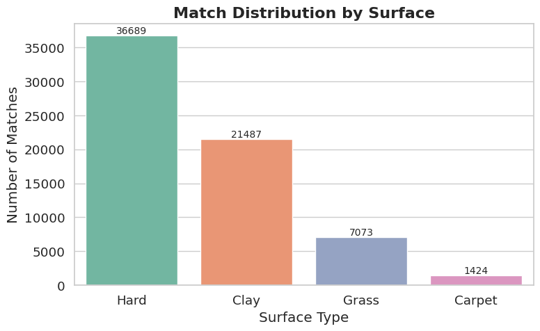
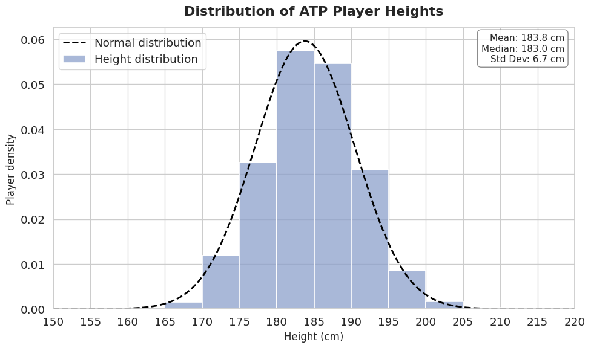
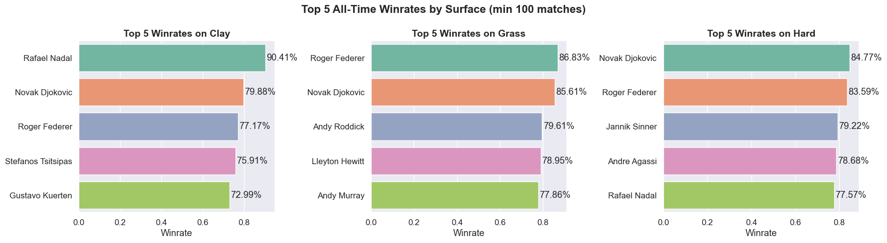
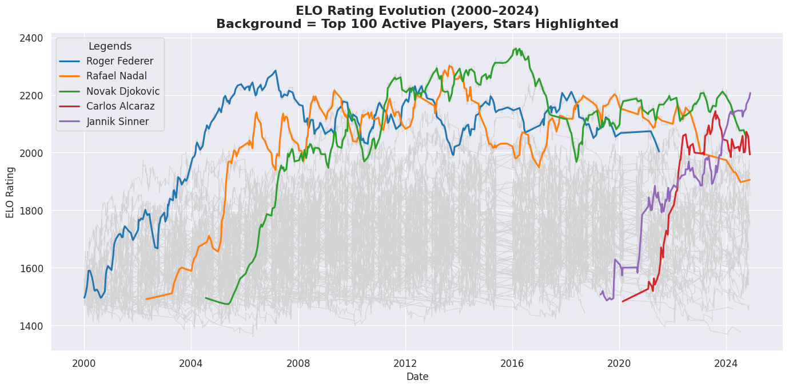
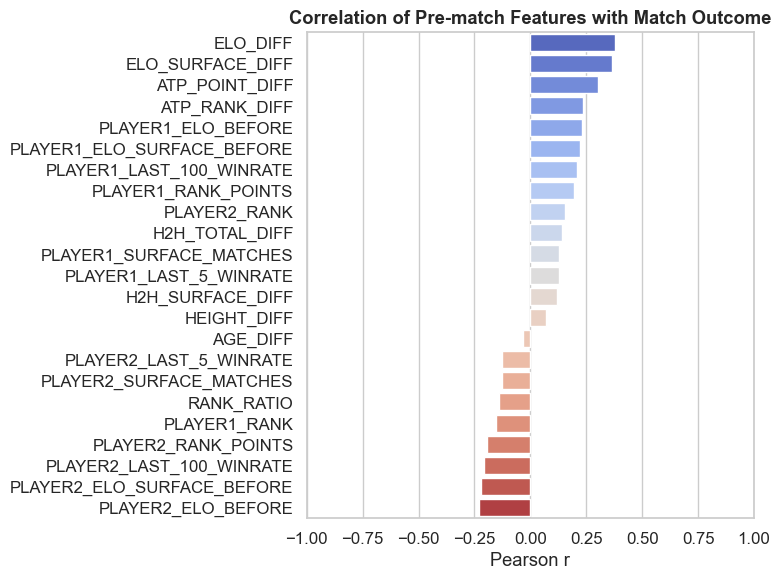

  

# ATP Match Prediction using Machine Learning and HPC

## Introduction

This project explores the intersection of **data science** and **high-performance computing (HPC)** for predicting professional tennis match outcomes on the ATP Tour. Tennis presents a rich ground for predictive modeling due to its one-on-one structure, detailed historical data, and standardized rules.

In this MSc thesis, we develop a pipeline to estimate the probability of a player winning a match using a wide set of features: player rankings, ELO scores, surface preferences, head-to-head history, and rolling statistics. The ultimate goal is not just to predict individual matches, but to simulate entire tournaments, such as the Australian Open or Roland-Garros, round by round, using probabilistic forecasts.

To scale these simulations and training processes, the project integrates distributed computing tools like **Dask** and **SLURM**, allowing for parallel execution on HPC clusters. This combination of **machine learning** and **parallel computing** demonstrates how scalable analytics can generate accurate and interpretable insights in the sports domain.

---

## Problem Statement & Objectives

### Why Tennis Outcome Prediction?

Unlike team sports, tennis features well-defined individual matchups and a wealth of historical data. Traditional prediction tools often rely on simple indicators like rankings or head-to-head stats. This project aims to build a more robust, data-driven approach that captures the deeper performance signals influencing match results.

### Problem Formulation

The task is framed as a **supervised binary classification problem**: given a set of pre-match features for both players, the model must predict whether the target player will win or lose. The dataset is structured symmetrically to reduce modeling bias, and performance is evaluated using metrics like **accuracy**, **F1 score**, and **log loss**, especially given the class imbalance in top-tier matches.

### Project Objectives

This project is organized into three key stages:

1. **Dataset Construction**

   - Start from Jeff Sackmann’s ATP data repository.
   - Clean and consolidate match data.
   - Engineer features such as rolling stats, ELO scores, surface metrics, and head-to-head indicators.

2. **Model Training and Evaluation**

   - Train several ML models: **Decision Tree**, **Random Forest**, and **XGBoost**.
   - Use a temporal train/test split to avoid data leakage.
   - Tune hyperparameters and assess performance using multiple evaluation metrics.

3. **Simulation of Matches and Tournaments**
   - Use the best-performing model to simulate full Grand Slam tournaments.
   - Apply Monte Carlo techniques to estimate win probabilities over randomized tournament trees.
   - Leverage HPC tools (Dask + SLURM) to parallelize simulations and reduce computational time.

This pipeline provides not only predictions but also insights into what drives success in tennis, leveraging the synergy between **statistical modeling** and **computational efficiency**.

---

## Data Collection and Preprocessing

The foundation of this project lies in the quality and structure of the historical match data used. This section describes the source of the data, the cleaning and formatting processes applied, and how a reliable dataset was constructed for machine learning and tournament simulation.

### Source Datasets

The core dataset comes from [Jeff Sackmann’s open-source ATP repository](https://github.com/JeffSackmann/tennis_atp), which provides season-by-season CSV files from 1968 onward. Each file includes detailed match-level information for ATP singles events.

Each dataset (e.g., `atp_matches_2024.csv`) contains over 50 columns and includes:

- **Tournament Information**:  
  `tourney_id`, `tourney_name`, `surface`, `draw_size`, `tourney_level`, `tourney_date`, `round`, `best_of`

- **Match Outcome and Scores**:  
  `score`, `match_num`, `minutes`

- **Player Metadata**:  
  `winner_name`, `loser_name`, `winner_hand`, `loser_hand`, `winner_age`, `loser_age`, `winner_ioc`, `loser_ioc`,  
  `winner_rank`, `loser_rank`, `winner_rank_points`, `loser_rank_points`

- **In-Match Statistics**:  
  Aces, double faults, serve points and games, first/second serve percentages, break points faced/saved

This granular feature set forms the foundation for both prediction models and tournament simulation. It provides rich context and performance-related insights, enabling deeper statistical modeling than simple win/loss records.

### Match History Formatting and Merging

All yearly CSV files were merged into a single structured DataFrame covering over 20 years of ATP matches. Key steps included:

- Standardizing column types (e.g., parsing dates, converting numerical fields)
- Adding derived fields such as match year and categorical surface type
- Filtering out exhibitions and incomplete matches
- Ensuring consistent match ordering and formatting

This step was essential to prepare a consistent dataset for supervised learning tasks.

> **Note:** The final merged and feature-enriched dataset was too large to be hosted directly on GitHub.  
> To regenerate it locally, simply run the following script from the repository:  
> [prediction_dataset.py](https://github.com/PaulSerin/TFM/blob/main/Code/1.Preprocessing/prediction_dataset.py)

---

## Feature Engineering

After cleaning and merging the historical match data, the next step was to engineer features that would enhance the predictive performance of machine learning models. Rather than relying on raw statistics, we translated domain knowledge into structured features that capture form, surface specialization, player dynamics, and skill estimation.

### Rolling Statistics

To reflect recent player momentum, we computed rolling statistics over fixed-size match windows. These include:

- Win rates over the last N matches (`PLAYER1_LAST_25_WINRATE`, etc.)
- Serve efficiency metrics such as:
  - First serve percentage (`PLAYER1_P_1STIN_LAST_50`)
  - Break points saved (`PLAYER2_P_BPSAVED_LAST_100`)

These features help capture the recent form and consistency of each player.

### Head-to-Head Metrics

Psychological or tactical advantages are captured using:

- `H2H_TOTAL_DIFF`: Net number of wins of PLAYER1 over PLAYER2
- `H2H_SURFACE_DIFF`: Same, restricted to matches on the current surface

These indicators summarize historical matchups and player-specific rivalries.

### Surface-Adjusted Performance

Performance can vary significantly across surfaces (e.g., clay vs grass). We include:

- Surface-specific match counts: `PLAYER1_SURFACE_MATCHES`, etc.
- Surface-specific win rates: `PLAYER1_LAST_50_WINRATE_CLAY`, etc.

These features capture player preferences and effectiveness on different surfaces.

### Elo-Based Features

The Elo rating system is a dynamic method for estimating a player's skill level, originally designed for chess but widely used in tennis analytics.

The Elo rating is updated after each match according to:

$$Elo_{new} = Elo_{old} + K * (S - E)$$

Where:

Where:

- `Elo_old`: rating before the match
- `K`: sensitivity factor (higher values make the Elo more reactive)
- `S`: actual outcome of the match (`1` for a win, `0` for a loss)
- `E`: expected probability of winning, calculated as:

$$E = \frac{1}{1 + 10^{({Elo}_{{opponent}} - {Elo}_{{player}})/400}}$$

In this project, both global and surface-specific Elo scores are used:

- `PLAYER1_ELO_BEFORE`, `PLAYER2_ELO_BEFORE`
- `PLAYER1_ELO_SURFACE_BEFORE`, `PLAYER2_ELO_SURFACE_BEFORE`
- Difference-based features: `ELO_DIFF`, `ELO_SURFACE_DIFF`

These features provide a robust and up-to-date representation of each player's strength relative to the opponent.

### Feature Symmetry and Target Construction

To avoid data leakage from the original winner/loser columns, each match was reformatted into a symmetrical structure:

- Two rows are created per match: one for each player perspective
- Features are renamed as `PLAYER1_*` and `PLAYER2_*`
- The binary target is `TARGET = 1` if PLAYER1 wins, `TARGET = 0` otherwise

This approach ensures:

- No positional bias
- Dataset balance by design
- Learning based only on feature differences, not column naming

For a detailed description of all features used in the project (including naming conventions and preprocessing logic), refer to the full [Feature Dictionary](https://github.com/PaulSerin/Data-Analytics-with-HPC/blob/main/Dictionnary.md).

---

---

## Exploratory Data Analysis and Visualization

Before training predictive models, an in-depth exploratory analysis was conducted to understand the dataset’s structure and key dynamics: surface distribution, player demographics, performance indicators, and feature correlations.

All generated plots are available here:  
[Code/2.Visualisation](https://github.com/PaulSerin/TFM/tree/main/Code/2.Visualisation)

---

### Match Distribution by Surface

  

Hard courts dominate the dataset, followed by clay and grass. Carpet is nearly absent in modern ATP play.

---

### Player Height Distribution

  

Most players fall between 180–190 cm, with a peak near 183 cm , consistent with serve performance advantages for taller players.

---

### Top 5 Win Rates by Surface

  

- **Nadal** excels on clay (90.41%)
- **Federer** leads on grass (86.83%)
- **Djokovic** dominates on hard (84.77%)

This confirms strong surface specialization among top players.

---

### Elo Evolution (2000–2024)

  

The "Big Three" (Djokovic, Nadal, Federer) maintained dominance for years.  
Rising stars like **Alcaraz** and **Sinner** show sharp recent progression.

---

### Feature Correlation with Match Outcome

  

Key predictive features include:

- `ELO_DIFF`
- `ELO_SURFACE_DIFF`
- `ATP_POINT_DIFF`

These correlations support the choice of features for training.

This exploratory phase confirmed the dataset’s richness in modeling tennis performance , justifying the inclusion of form, surface, and skill metrics in the ML pipeline.

All generated plots can be found in the following directory:  
[Code/2.Visualisation](https://github.com/PaulSerin/TFM/tree/main/Code/2.Visualisation)

---

## Model Training and Evaluation

After constructing a rich feature set from historical ATP data, three supervised models were trained to predict match outcomes:

- **Decision Tree**
- **Random Forest**
- **XGBoost**

The complete training and evaluation process is available in the notebook:  
[Training_Evaluating.ipynb](https://github.com/PaulSerin/TFM/blob/main/Code/3.Training/Training_Evaluating.ipynb)

A **temporal split** was used: training on 2000–2023, testing on the 2024 season. This avoids data leakage and simulates real-world deployment.

### Summary of Results

| Model         | Accuracy | F1 Score | Log Loss |
| ------------- | -------- | -------- | -------- |
| Decision Tree | 64.05%   | 64.18%   | 0.6232   |
| Random Forest | 64.90%   | 64.87%   | 0.6172   |
| XGBoost       | 66.03%   | 66.15%   | 0.6057   |
| XGBoost (HPC) | 68.96%   | -        | -        |

### Visual Comparison of Models

#### Confusion Matrices

These matrices show the distribution of correct and incorrect predictions. A well-balanced matrix indicates symmetry in predicting wins and losses.

  
  
  

<em>
Decision Tree (left) is fairly balanced, Random Forest (middle) shows better symmetry,  
XGBoost (right) further improves precision for both classes.
</em>

#### Top Feature Importances

These plots highlight the top 20 features used by each model. Across all models, \texttt{ELO_DIFF} is the most influential predictor, confirming the value of ELO in modeling tennis matches.

  
  
  

<em>
All models heavily rely on ELO-based features. XGBoost (right) uses a more diverse set,  
suggesting better use of nuanced indicators like recent form and surface specialization.
</em>

---

### Distributed Hyperparameter Tuning with HPC

To enhance model performance, **XGBoost** was optimized using a **distributed hyperparameter search** on the **Finisterrae III supercomputer** using **Dask + SLURM**.

All relevant code and scripts for this distributed tuning process are available here:  
[Code/3.Training/XGBoost](https://github.com/PaulSerin/TFM/tree/main/Code/3.Training/XGBoost)

- 4 GPU nodes (NVIDIA A100, 32 cores, 40GB RAM each)
- 233 training tasks executed in **128 seconds wall time** (vs 88 mins sequentially)
- Achieved final test accuracy of **68.96%**

#### Dask Profiling Visuals

These visuals confirm the high parallel efficiency and low communication overhead:

  
  
  

<em>
Left: Dense task scheduling across workers.  
Middle: Uniform CPU/GPU usage across threads.  
Right: Very low inter-worker bandwidth confirms minimal overhead.
</em>

The final XGBoost model will now serve as the backbone for full-scale tournament simulations, described in the next chapter.

---

## Match and Tournament Simulation

This chapter applies the trained XGBoost model to simulate real-world tennis outcomes , from individual matchups to full tournament runs. It serves as the ultimate validation stage for our machine learning pipeline.

### Predicting Individual Matches

Simulations were performed between **Carlos Alcaraz** and **Jannik Sinner** across clay, hard, and grass to test surface awareness.

  
  <strong style="margin: 0 20px;">VS</strong>
  

| Surface | Alcaraz Win % | Sinner Win % |
| ------- | ------------- | ------------ |
| Clay    | 49.5%         | 50.5%        |
| Hard    | 48.6%         | 51.4%        |
| Grass   | 51.3%         | 48.7%        |

These results confirm that the model correctly adapts to surface-specific performance patterns.  
All related code and results can be found in the following notebook: [Training_Evaluating.ipynb](https://github.com/PaulSerin/TFM/blob/main/Code/3.Training/Training_Evaluating.ipynb)

---

### Real Tournament Simulations

#### Australian Open 2025

- **Matches simulated**: 107
- **Correct predictions**: 75
- **Accuracy**: **70.09%**

  

#### Roland-Garros 2025

- **Matches simulated**: 127
- **Correct predictions**: 93
- **Accuracy**: **73.23%**

  

---

### Monte Carlo Simulations (5000 draws)

Simulated 5000 tournament draws for each Grand Slam using a randomized bracket generator and probabilistic win assignments. All simulation code and parallel execution scripts are available here: [XGBoost with Dask](https://github.com/PaulSerin/TFM/tree/main/Code/3.Training/XGBoost)

#### Australian Open – Top 10 Players

| Player    | Champion % |
| --------- | ---------- |
| Sinner    | 16.88%     |
| Alcaraz   | 10.70%     |
| Rublev    | 5.68%      |
| De Minaur | 5.52%      |
| Korda     | 4.34%      |
| Medvedev  | 4.32%      |
| Shelton   | 3.18%      |
| Djokovic  | 3.02%      |
| Mensik    | 2.68%      |
| Zverev    | 2.54%      |

#### Roland-Garros – Top 10 Players

| Player    | Champion % |
| --------- | ---------- |
| Alcaraz   | 9.68%      |
| Tsitsipas | 9.06%      |
| Sinner    | 8.26%      |
| Djokovic  | 6.52%      |
| Zverev    | 5.72%      |
| Ruud      | 3.94%      |
| Rune      | 3.94%      |
| Rublev    | 3.36%      |
| Musetti   | 2.26%      |
| Fritz     | 2.14%      |

These simulations align closely with real results: Sinner won the AO, and Alcaraz triumphed at Roland-Garros.

---

### Monte Carlo Acceleration with SLURM (1–16 GPUs)

To efficiently parallelize the 5000 simulations per tournament, the pipeline was distributed on the Finisterrae III supercomputer using SLURM job arrays. Execution time, speedup, and parallel efficiency were measured.

#### Execution Time

  

#### Speedup

  

#### Parallel Efficiency

  

The total runtime dropped from over **2 hours to under 10 minutes** when scaling from 1 to 16 GPUs. The workload is embarrassingly parallel, making it ideal for HPC deployment using Dask and SLURM.

## Limitations and Perspectives

While the results obtained in this project are encouraging, several limitations must be acknowledged. These naturally open the door to meaningful future improvements.

### Player Injuries and Physical Condition

One of the most important limitations is the absence of explicit information about injuries or player fitness. Although rolling features such as `WINRATE_LAST_5` may implicitly capture dips in form, the model cannot distinguish between temporary injuries and genuine loss of form. Integrating public injury reports or withdrawal records could improve prediction accuracy, especially for high-variance players.

### Gender-Specific Analysis and Generalization

This study focused exclusively on the ATP Tour. Extending the same methodology to WTA (women’s tennis) would enable comparative analysis. Differences in playing style and match dynamics (e.g., rally length, serve dominance) may shift feature importance and affect model behavior. Comparing ATP and WTA predictive models could lead to deeper insights into gender-specific patterns in tennis.

### Beyond the Numbers: Human Factors

Psychological and contextual variables, such as home crowd advantage, emotional pressure, or rivalry dynamics, are absent from the current dataset. These are known to affect elite performance but are difficult to quantify. Potential proxies such as “home advantage” flags or tournament location could be added to partially bridge this gap.

### Environmental Conditions

Key environmental factors (temperature, humidity, altitude, type of balls) were not considered. These affect match conditions and player efficiency, especially on outdoor courts. For instance, high altitude in Madrid boosts serve speed, while clay in humid conditions slows down play. Including such variables would allow finer modeling of surface- and context-dependent player performance.

### Limits of the Elo Feature

Despite being one of the most predictive variables, `ELO_DIFF` has limitations. Elo is slow to adapt and may underrepresent rising stars or returning players (e.g., from injury). A hybrid system that combines Elo with short-term momentum metrics (e.g., recent win streaks) could address this lag and better capture dynamic form changes.

### Responsible Use and Betting Caution

While model accuracies exceed 70%, it is critical to emphasize that this project is not intended for betting use. Professional betting markets incorporate real-time data and strategic odds setting, often reflecting insider information. Relying on historical models without access to live updates can result in misleading confidence and financial loss. This work aims to understand and simulate competitive dynamics, not to promote betting.

### Future Work and Perspectives

This project lays a solid foundation for scalable sports forecasting. Several promising extensions include:

- **Dynamic updating**: Adopting online learning approaches to refresh features and retrain the model after each match.
- **Ensemble modeling**: Combining XGBoost, Random Forests, and possibly neural networks for more robust predictions.
- **Visualization and interfaces**: Creating dashboards or web applications for coaches, fans, or journalists to interact with predictions and simulations.
- **Explainability**: Applying tools like SHAP or LIME to explain individual predictions and increase user trust in the system.

In conclusion, these limitations do not reduce the value of the current approach but rather highlight directions for future progress and greater realism in predictive modeling.

---

## Conclusion

This thesis explored the use of machine learning and high-performance computing to model and simulate the outcomes of professional tennis matches. From raw ATP data to full tournament simulations, the project covered the full pipeline: data collection, feature engineering, model training, evaluation, and deployment at scale.

The predictive performance achieved, particularly with XGBoost, was solid, with test accuracies exceeding 70% on recent data. Simulating tournaments like the 2025 Australian Open and Roland-Garros provided further validation, with the model correctly identifying match winners in over 70% of cases and even forecasting the eventual champions in repeated Monte Carlo draws. These results confirmed the model’s ability to generalize and adapt to different players, surfaces, and match contexts.

One of the key contributions of this work lies in the integration of HPC tools such as Dask and SLURM to accelerate model training and simulation. The use of distributed computing significantly reduced execution time and enabled large-scale experimentation, making it possible to simulate thousands of tournaments or perform exhaustive hyperparameter searches in parallel.

The study also emphasized the importance of domain knowledge in feature design. Variables like surface-aware Elo ratings, recent win ratios, or serve metrics contributed to capturing nuances in player performance that go beyond simple rankings. These engineered features proved essential for both model accuracy and interpretability.

That said, the approach has limitations. Contextual factors such as injuries, fatigue, or psychological stress are not included, and the model cannot react to last-minute events that influence match outcomes. Environmental conditions and off-court factors , which are often decisive in elite sport, remain outside the scope of this system. Additionally, the model has been trained strictly on ATP data; adapting it to WTA or mixed competition would require dedicated adjustments and validation.

From an ethical and practical perspective, it is important to stress that this model is not intended for betting purposes. Real-time odds markets incorporate information that is unavailable here, and financial applications would require a far more robust and dynamic infrastructure. The goal of this project is scientific: to simulate, understand, and explain competitive tennis, not to predict it with certainty.

When compared to similar studies, the results obtained are competitive. With nearly 69% accuracy on fully unseen 2024 matches, this work matches or exceeds several prior approaches using neural networks or logistic regression, all while preserving a strict methodology to avoid data leakage. Unlike other models that rely on betting odds as features, this project prioritized transparency and generalization.

In summary, this thesis demonstrates that combining structured sports data with modern machine learning and HPC tools enables meaningful simulations of professional competition. While far from perfect, the model offers a statistically grounded lens through which to explore the game, forecast trends, and understand the key drivers of success in tennis. More broadly, it shows how data science and HPC can bring rigor and insight into the inherently uncertain world of sport.

  

