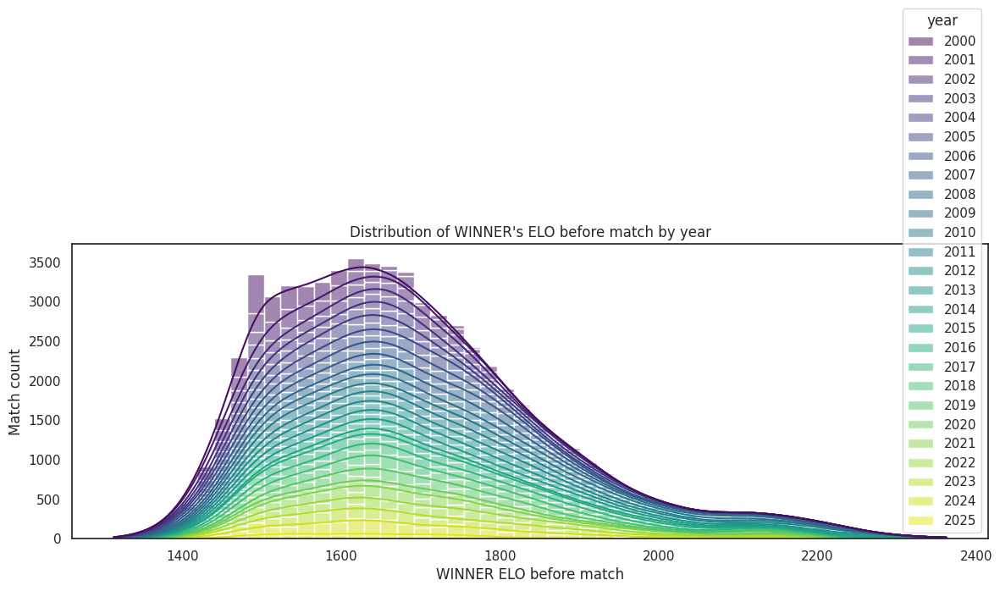
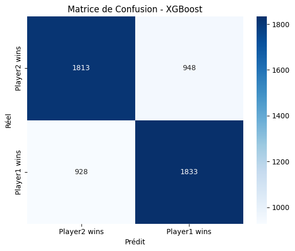
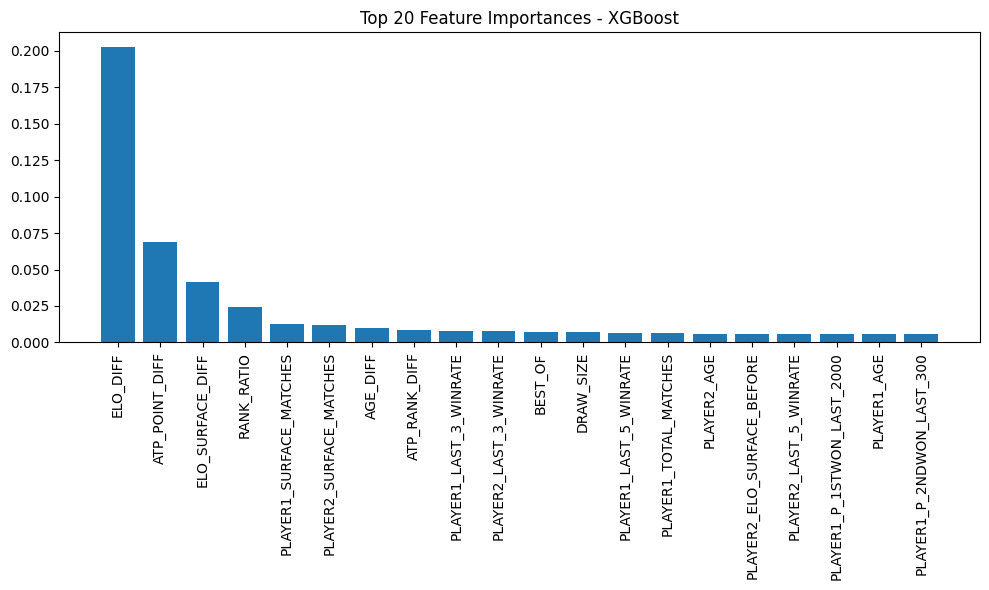

# Tennis Match Prediction with Data Analytics & HPC

## Description

This project aims to predict the outcome of professional ATP tennis matches using machine learning techniques and HPC-oriented pipelines. It combines advanced feature engineering with clean modeling practices to ensure real-world reliability of predictions.

## Objectives

- Build a structured and enriched tennis match dataset
- Engineer features from player stats, ELO ratings, historical performance, surfaces, etc.
- Train machine learning models on realistic pre-match features
- Provide interactive tools to simulate and predict future matches
- Explore HPC extensions for distributed and accelerated training

---

## Repository Structure

```bash
.
├── Code/
│   ├── 0.Utils/                       # Shared functions and testing utilities
│   │   ├── checklist.py
│   │   ├── testUtils.py
│   │   ├── utils.py
│   │   └── utilsNB.ipynb
│   ├── 1.Preprocessing/              # Data loading and feature engineering
│   │   ├── DataPreprocessing.ipynb
│   │   ├── final_tennis_dataset.py
│   │   └── prediction_dataset.py
│   ├── 2.Visualisation/
│   │   └── DataVisualisation.ipynb
│   ├── 3.Prediction/
│   │   └── predictions.ipynb
├── Data/                             # Raw match data
│   ├── atp/
│   ├── 2025/
│   ├── players/
│   ├── ranking/
│   └── matches_data_dictionary.txt
├── Datasets/                         # Preprocessed datasets
│   ├── final_tennis_dataset.csv
│   ├── final_tennis_dataset_symmetric.csv
│   └── final_tennis_dataset_symmetric.parquet
├── Images/                           # Plots and evaluation graphics
├── Models/                           # (optional) Saved models
├── .gitignore
├── README.md
├── requirements.txt
└── requirements_pip.txt
```

## Data Sources

All match data is sourced from [Jeff Sackmann's tennis repository](https://github.com/JeffSackmann/tennis_atp), containing over 160,000 ATP matches since 1968. Only matches from 2000 onward are retained after cleaning.

## Feature Engineering

More than 190 features are generated per match, including:

### Player Info

- Age, height, rank, ranking points
- Player ID, nationality, handedness

### Surface and Match Context

- Surface (Clay, Grass, Hard, Carpet) with one-hot encoding
- Tournament level and round
- Match type (`BEST_OF`: 3 or 5 sets)

### Historical Statistics

- Winrate over last N matches (N = 3, 5, 10, 25, 50, 100, 200, 300, 2000)
- Number of surface-specific matches
- Head-to-head history between both players:
  - `H2H_TOTAL_DIFF`
  - `H2H_SURFACE_DIFF`

### ELO Ratings

- Global ELOs before the match:
  - `PLAYER1_ELO_BEFORE`
  - `PLAYER2_ELO_BEFORE`
  - `ELO_DIFF`
- Surface-specific ELOs:
  - `PLAYER1_ELO_SURFACE_BEFORE`
  - `PLAYER2_ELO_SURFACE_BEFORE`
  - `ELO_SURFACE_DIFF`

### Engineered Metrics

- `AGE_DIFF`, `HEIGHT_DIFF`
- `ATP_POINT_DIFF`, `ATP_RANK_DIFF`, `RANK_RATIO`
- `SERVE_DOMINANCE` (based on aces, 1st and 2nd serve win %)
- `BP_EFFICIENCY` (break point efficiency win/loss)
- `TOTAL_MATCHES_DIFF`, `SURFACE_MATCHES_DIFF`

---

## Data Dictionary

A complete **data dictionary** is available at: ./Dictionnary.md

This file describes all columns used in the final dataset, including:

- Raw fields (e.g. `PLAYER1_ID`, `SURFACE`, `TOURNEY_DATE`)
- Engineered features (e.g. `ELO_DIFF`, `SERVE_DOMINANCE`, `LAST_10_WINRATE`)
- Encoded variables (e.g. one-hot surface columns)
- Rolling serve statistics per time window

## Visualizations

All visualizations are implemented in `2.Visualisation/DataVisualisation.ipynb`, including:

- Surface distribution analysis
- Match length per surface
- Score format distribution (straight sets, tiebreaks, etc.)
- Yearly ELO distributions
- Player match experience distribution
- Rolling winrate and serve stats evolution
- Feature importance heatmaps




## Modeling

Modeling is handled in `3.Prediction/predictions.ipynb`.

### Models Used

- Decision Tree (sklearn)
- Random Forest (sklearn)
- XGBoost (with and without calibration or grid search)

### Evaluation Metrics

- Accuracy
- F1 Score
- Log Loss
- ROC AUC
- Confusion Matrix
- Feature Importance

## Data Leakage: Identified and Removed

Initial model results were highly over-optimistic, reaching over 90% accuracy. After inspection, it became clear the dataset included **post-match statistics**:

- `PLAYER1_ACE`, `PLAYER2_DF`
- `SCORE`, `MINUTES`
- Serve stats like `1ST_IN`, `1ST_WON`, `2ND_WON`
- Break points faced/saved

These are not available **before** the match and led to data leakage. All such features were removed from the final dataset to ensure valid, real-world predictions.

## Final Results (2024 Test Set)

The models were retrained using only **pre-match** information. Below are the updated and realistic performance metrics.

### Decision Tree

- Accuracy : 0.6405
- F1 Score : 0.6418
- Log Loss : 0.6232

### Random Forest

- Accuracy : 0.6490
- F1 Score : 0.6487
- Log Loss : 0.6172

### XGBoost

- Accuracy : 0.6603
- F1 Score : 0.6615
- Log Loss : 0.6057



## Top Features (XGBoost)

Based on gain importance, the top predictors were:

- `ELO_DIFF`
- `ELO_SURFACE_DIFF`
- `PLAYER1_SURFACE_MATCHES`
- `PLAYER2_SURFACE_MATCHES`
- `ATP_POINT_DIFF`
- `RANK_RATIO`
- `AGE_DIFF`



## Player vs Player Match Simulator

Functions implemented in `Code/0.Utils/utils.py` allow for custom simulations between any two players.

These utilities:

- Load relevant pre-match stats for both players
- Adjust for surface
- Use trained model to estimate win probability
- Perform Monte Carlo simulations to estimate robustness

### Example: Match on Clay

```bash
Carlos Alcaraz (PLAYER1\_) stats on CLAY:
ELO: 2032
ELO_SURFACE: 1902
RANK: 3
RANK_POINTS: 8145
AGE: 20.9
HEIGHT (cm): 183
SURFACE_MATCHES: 78
LAST_5_WINRATE: 80.00%

Jannik Sinner (PLAYER2\_) stats on CLAY:
ELO: 2137
ELO_SURFACE: 1799
RANK: 2
RANK_POINTS: 8660
AGE: 22.6
HEIGHT (cm): 191
SURFACE_MATCHES: 63
LAST_5_WINRATE: 80.00%

Prediction: Carlos Alcaraz win probability: 60.66%
Jannik Sinner win probability: 39.34%
Monte Carlo (100 runs): Carlos Alcaraz wins 53.00%
Monte Carlo (500 runs): Carlos Alcaraz wins 58.20%

shell
Copy
Edit
```

### Example: Match on Hard

```bash
Carlos Alcaraz (PLAYER1\_) stats on HARD:
ELO: 2041
ELO_SURFACE: 2002
RANK: 2
RANK_POINTS: 8805
AGE: 20.8
HEIGHT (cm): 183
SURFACE_MATCHES: 111
LAST_5_WINRATE: 100.00%

Jannik Sinner (PLAYER2\_) stats on HARD:
ELO: 2126
ELO_SURFACE: 2110
RANK: 3
RANK_POINTS: 8310
AGE: 22.5
HEIGHT (cm): 191
SURFACE_MATCHES: 192
LAST_5_WINRATE: 80.00%

Prediction: Carlos Alcaraz win probability: 41.90%
Jannik Sinner win probability: 58.10%
Monte Carlo (500 runs): Carlos Alcaraz wins 39.80%
```

## Next Steps and HPC Roadmap

This project serves as the foundation for deeper exploration in high-performance computing (HPC) and advanced tennis match modeling. Several exciting directions are planned:

---

### 1. Hyperparameter Tuning with HPC Grid Search

The next objective is to run **large-scale hyperparameter optimization** for the XGBoost model using HPC resources:

- Implement **GridSearchCV** or **RandomizedSearchCV** across a cluster.
- Distribute the computation across multiple nodes using `joblib` or `Dask`.
- Focus on tuning key parameters: `max_depth`, `learning_rate`, `n_estimators`, `subsample`, etc.

This will help improve model generalization and refine how features like `ELO_DIFF` impact prediction accuracy.

---

### 2. Sensitivity Analysis on ELO

One of the most important predictors identified across all models is `ELO_DIFF`, which captures the difference in global Elo rating between both players before the match. Because Elo plays such a crucial role in the final prediction, the way it is computed can **drastically affect the model's performance and reliability**.

Currently, Elo ratings are updated after each match using the standard formula:

\[
E*w = \frac{1}{1 + 10^{\frac{(E*{\text{loser}} - E\_{\text{winner}})}{400}}}
\]

Then both player ratings are updated based on match outcome and surface:

- Global Elo:
  \[
  ELO*{\text{winner}} \leftarrow ELO*{\text{winner}} + K \cdot (1 - E*w)
  \]
  \[
  ELO*{\text{loser}} \leftarrow ELO\_{\text{loser}} + K \cdot (0 - (1 - E_w))
  \]

- Surface-based Elo (e.g., Clay, Grass, Hard) is updated in the same way with surface-specific ratings.

The constant \( K \) (currently set to 32) controls how fast Elo ratings are adjusted after each match. However, this value may be suboptimal for tennis, where rankings evolve at different rates based on player profiles or match formats (Best-of-3 vs Best-of-5).

#### Future Directions

- **Explore different K values** or adaptive K strategies (e.g., K decays with number of matches played).

These improvements may lead to a more realistic reflection of a player's dynamic skill level and offer better generalization in the final predictions.

---

### 3. Simulate a Full Tournament (e.g., Roland-Garros 2025)

I aim to **simulate an entire ATP tournament** round by round using our trained model:

- Use real brackets and players for Roland-Garros 2025.
- Predict the outcome of each match using the XGBoost model.
- Advance winners through the draw until a simulated champion is determined.

This simulation will be enhanced by:

- **Monte Carlo experiments** (e.g., 1000 tournament simulations)
- Estimating probabilities of reaching each round or winning the event.
- Visualizing players' chances as probabilistic trees or histograms.

---

### 4. Monte Carlo Simulations at Scale

Monte Carlo runs can be **parallelized and scaled** using HPC techniques:

- Run thousands of simulations simultaneously on HPC nodes.
- Aggregate player-level win percentages and consistency metrics.
- Compare different seeding scenarios or tournament surfaces.

---

These steps will demonstrate how **HPC can scale, accelerate, and enrich sports analytics workflows**, bringing data-driven insights to professional tennis forecasting.
